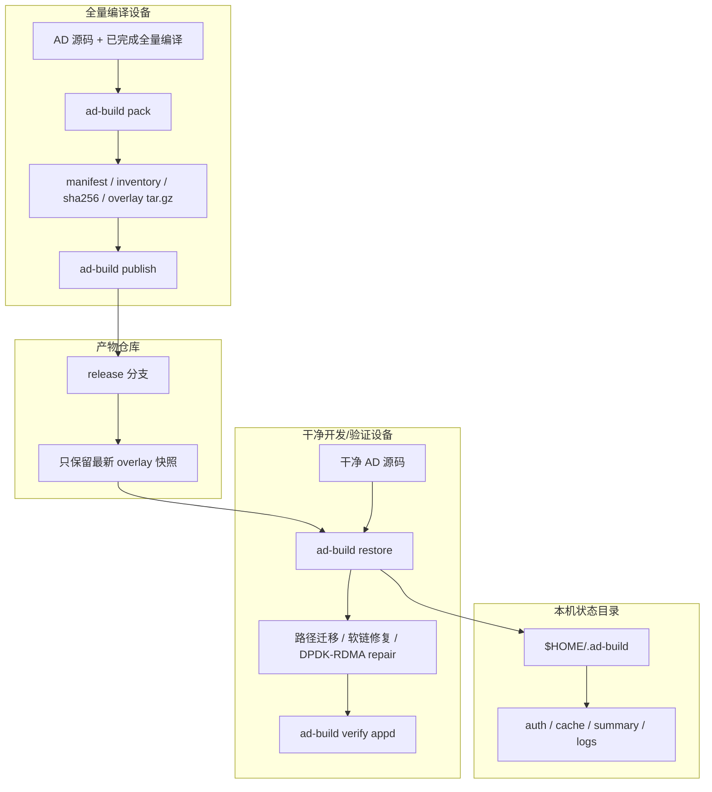
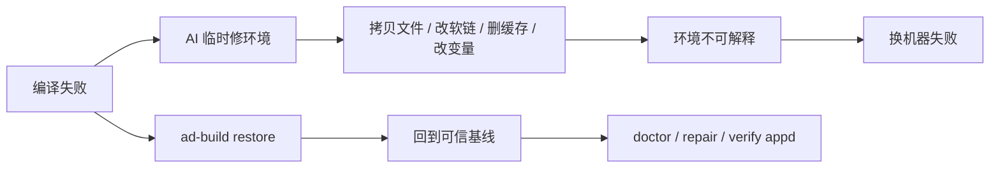
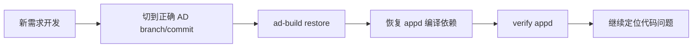

# ad-build：把 1.5 小时全量编译变成 10 分钟可信恢复

> 面向 `appd` MVP 的编译环境恢复工具。核心目标：减少新需求验证等待，并避免 AI 编译排障把环境越修越乱。

## 核心价值

| 目标 | 价值 |
| --- | --- |
| 新需求快速验证 | 复用一次可信全量编译产物，干净 AD 源码恢复后直接验证 `appd` |
| AI 排障可控 | AI 编译失败后不用手工乱修环境，先 `restore` 回可信基线 |
| 环境可复现 | manifest、inventory、sha256、source branch/commit 全部记录 |
| 操作可审计 | 发布、恢复、诊断都走固定 CLI，不依赖个人 shell 经验 |

## 两个关键痛点

| 痛点 | 过去 | 现在 |
| --- | --- | --- |
| AI 编译失败后污染环境 | AI 可能临时拷贝头文件、改软链、删缓存、改系统路径，导致环境状态不可解释 | `ad-build restore` 恢复可信 overlay 基线，再用 `doctor` / `repair` / `verify appd` 定位真实错误 |
| 每个新需求都要全量编译 | 做一个新需求也要等完整环境重新编译，通常约 1.5 小时 | 复用已发布的全量编译产物，恢复到可验证状态约 10 分钟 |

## 技术架构



## AI 污染环境场景



## 新需求验证场景



## 快速上手

### 1. 一键安装

```bash
npm install -g ad-build
ad-build skill status
```

### 2. 发布端：全量编译设备

在已经完成全量编译的可信 AD 工作区执行：

```bash
cd /root/AD
ad-build login
ad-build pack --branch release-AD7.0.29R2
ad-build publish --branch release-AD7.0.29R2
```

| 步骤 | 作用 | 成功后得到什么 |
| --- | --- | --- |
| `login` | 配置产物仓库 SSH 访问 | 后续可访问 overlay repo |
| `pack` | 扫描并打包 `appd` 编译依赖 | 本地 overlay、manifest、inventory、sha256 |
| `publish` | 发布到同名 release 分支 | 干净设备可拉取最新 overlay |

### 3. 使用端：干净开发/验证设备

在干净 AD 源码工作区执行：

```bash
cd /root/workspace/AD
ad-build login
ad-build restore --branch release-AD7.0.29R2
ad-build verify appd
```

| 步骤 | 作用 | 通过标准 |
| --- | --- | --- |
| `login` | 配置 SSH key | SSH 探测通过 |
| `restore` | 恢复 overlay，修路径、软链和 DPDK/RDMA 缓存 | summary 状态为 `ready` |
| `verify appd` | 编译验证 `appd` | 构建通过，或输出 first real error |

### 4. 诊断命令

| 场景 | 命令 |
| --- | --- |
| 查看当前恢复状态 | `ad-build status` |
| 检查依赖、旧路径、软链、readiness | `ad-build doctor` |
| 重新修路径和 managed symlink | `ad-build repair paths` |
| 重新构建 DPDK/RDMA 缓存 | `ad-build repair dpdk` |
| 重新验证 `appd` | `ad-build verify appd` |

## 关键机制

| 机制 | 解决的问题 |
| --- | --- |
| artifact overlay | 只保存编译必要产物，不复制整个 AD 仓库 |
| source metadata 前置校验 | 拉大包前先确认 branch/commit，避免拉完才发现不匹配 |
| manifest + inventory | 明确记录恢复哪些文件、软链、sha256 和来源 |
| 受控 repair | 路径迁移、软链修复、DPDK/RDMA 缓存重建由 CLI 固化 |
| 单快照发布 | 产物分支只保留最新 overlay，避免旧 3G 历史拖慢拉取 |
| AI 操作边界 | AI 只走 `restore` / `doctor` / `repair` / `verify`，不自由手工改环境 |

## 使用原则

| 原则 | 说明 |
| --- | --- |
| 源码不一致不要默认恢复 | `restore` 提示 branch/commit 不一致时，先核对输出；只有接受风险才加 `--force` |
| 不用手工命令替代 CLI | 不用临时 `tar`、`sed`、`ln`、`make`、复制头文件来修环境 |
| AI 先恢复再排查 | 环境乱了先 `restore`，再让 AI 看日志和 `doctor` 结果 |
| 不夸大范围 | 当前验证目标是 `appd` overlay MVP，不代表所有 AD 模块 |

## 当前边界

| 已验证 | 后续方向 |
| --- | --- |
| `appd` overlay MVP | 扩展到 AD 高频模块 |
| 快速恢复 `appd` 编译环境 | 继续优化恢复耗时和进度展示 |
| 减少重复全量编译等待 | 按模块沉淀更多 overlay 策略 |
| 受控诊断和 repair | 补齐更多真实设备失败样本 |
